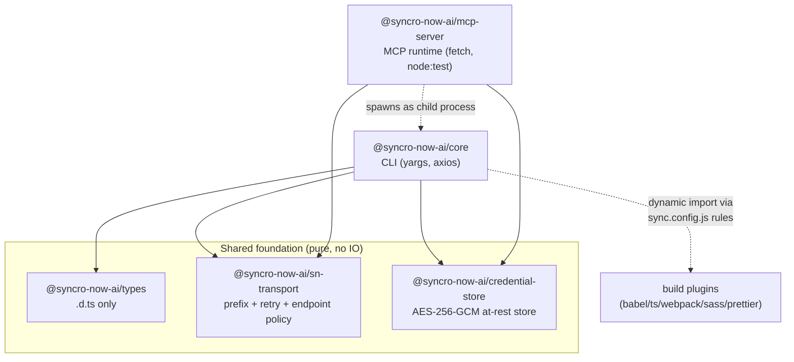
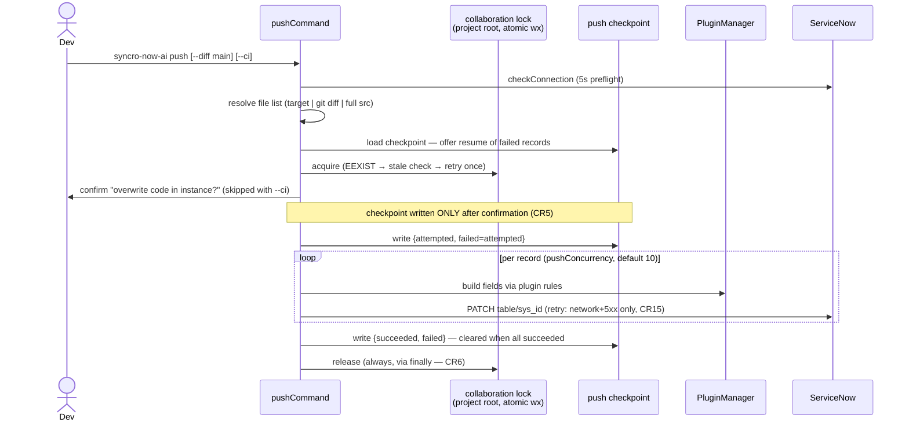
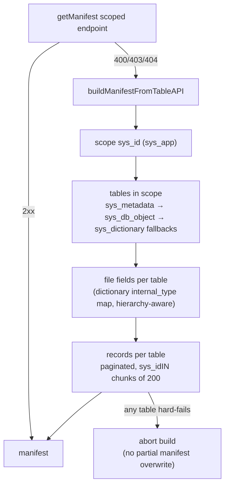
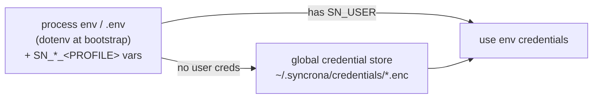
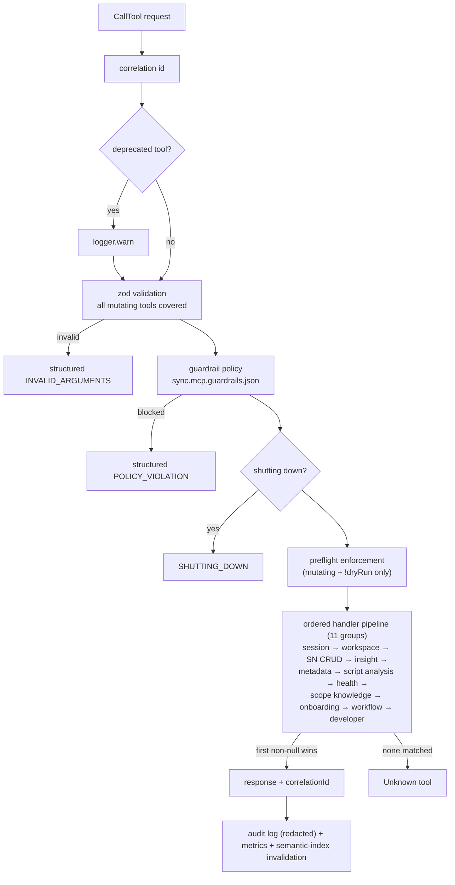
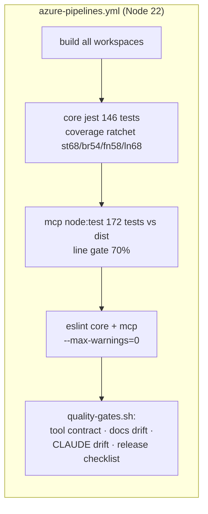

# SyncroNow AI — Architecture

> Last updated: 2026-06-12 (post CR1–CR30 fix series). Companion document:
> [PRODUCT_STATE.md](PRODUCT_STATE.md) for what is done and what remains.

SyncroNow AI is a monorepo that ships a ServiceNow development toolchain:
a **CLI** that syncs scoped-application files between a local workspace and a
ServiceNow instance, and an **MCP server** that exposes the same instance to
AI agents through ~60 governed tools.

## 1. Workspace layout

```
packages/
  core/                 @syncro-now-ai/core           — the CLI (bin: syncrona)
  mcp-server/           @syncro-now-ai/mcp-server     — MCP runtime (stdio JSON-RPC)
  types/                @syncro-now-ai/types          — shared .d.ts type surface
  credential-store/     @syncro-now-ai/credential-store — at-rest credential crypto
  sn-transport/         @syncro-now-ai/sn-transport   — shared HTTP transport policy
  babel-plugin/  babel-plugin-remove-modules/  babel-preset-servicenow/
  typescript-plugin/  webpack-plugin/  sass-plugin/  prettier-plugin/  eslint-plugin/
                        — build-pipeline plugins loaded via sync.config.js rules
```

### Package dependency graph



Build order is enforced by the root `build:deps` script: `credential-store` and
`sn-transport` compile before their consumers.

**Two HTTP clients by design.** The CLI uses axios (+ rate limit, one-shot
process); the MCP server uses native `fetch` (long-lived process, per-status
backoff). They are deliberately not merged — instead, every policy they must
agree on lives in `@syncro-now-ai/sn-transport`:

- scoped API prefix order (`x_nuvo_sinc`/`x_nuvo_sync`, `SYNCRONA_SCOPED_API_PREFIXES` override),
- retryable HTTP statuses (408/425/429/5xx),
- endpoint-not-found statuses (400/403/404 — "scoped app not installed, fall back").

## 2. Core CLI

Entry: `packages/core/src/index.ts` → `bootstrap.init()` → config load →
dotenv → credential preload → update notifier → `commander.initCommands()`
(yargs, strict mode, every handler wrapped so async failures log + set
`process.exitCode`).

### Module map (packages/core/src)

| Area | Modules |
|---|---|
| Command layer | `cliCommands` (declarative command registry), `commander` (registry interpreter), `commands` (init/download/build/deploy/docs), `pushCommand`, `devCommands`, `authCommands`, `diagnosticsCommands` (status/doctor/plugins), `mcpCommand`, `commandHelpers` |
| Sync engine | `appUtils` (manifest processing, push/build), `manifestBuilder` (Table-API fallback builder, paginated), `FileUtils`, `Watcher` (chokidar, serialized queue), `PluginManager` |
| Instance access | `snClient` (axios client factory + credential resolution), `auth` (re-export of credential-store) |
| Infrastructure | `config` (ConfigStore singleton + factory), `Logger` (winston), `gitUtils` (execFile-based diff), `updateNotifier`, `wizard`, `scopeDocs`, `envFile`, `genericUtils` |

### The push flow (most safety-critical path)



Recovery semantics: an interrupted push leaves `sync.push.checkpoint.json`;
the next push offers to resume only the failed records. A stale lock
(>30 min) is replaced automatically.

### Manifest and download

`syncro-now-ai download <scope>` / `refresh` prefer the scoped companion app
endpoints (`api/<prefix>/sinc/getManifest`, `bulkDownload`). When the scoped
app is not installed (any 400/403/404), `manifestBuilder` reconstructs the
manifest purely from the standard Table API:



Guarantees added in the CR series: full pagination (no silent >500 truncation),
error ≠ empty (network failure aborts instead of producing a sparse manifest),
and a zero-tables result refuses to overwrite a previously good manifest.

### Credential resolution (CLI)



`--instance-profile dev` maps to `SN_INSTANCE_DEV`/`SN_USER_DEV`/`SN_PASSWORD_DEV`.
The store is AES-256-GCM with a machine-derived key — **obfuscation-grade**
(documented in the core README); Keychain integration is the planned fix (D5).

## 3. MCP server

Entry: `packages/mcp-server/src/index.ts`. Speaks MCP JSON-RPC over **stdout**;
all logging is **stderr-only** (`logger.ts`, text or JSON via
`SYNCRONA_LOG_FORMAT`/`--log-format`). Startup order: metrics restore → audit
integrity check (quarantine on corruption) → stdio connect → **then**
background auto-pull of scopes (CR23 — the handshake is never blocked by
network work).

### CallTool request pipeline



The pipeline dispatch itself is a pure, unit-tested function
(`toolDispatch.ts`); handlers receive explicit dependency objects.

### Safety model (honest version)

| Layer | What it is | What it is NOT |
|---|---|---|
| `safetyPolicy` deny-list | UX guardrail against obvious foot-guns (`rm`, `sudo`, `bash -c`, shell tokens) | a security boundary — bypassable via `node -e`, `npx`, etc. |
| Guardrail config + preflight | scope/update-set expectations enforced before mutations | instance-side ACL |
| `dryRun` + audit log | planned-action preview; append-only redacted JSONL with rotation + integrity quarantine | tamper-proof audit |
| Approval metadata | recorded for traceability | verified approvals |

Secrets resolution (MCP): `process env > .syncrona-mcp/secrets.json > .env >
credential store`, cached 30 s per project dir (the store's scrypt derivation
is too expensive for per-request resolution — CR21).

## 4. Quality gates



- Core tests: ts-jest against TS source. MCP tests: `node --test` against the
  compiled `dist/` (a deliberate, documented trade-off; full ts-jest migration
  is parked as high-risk — AR9). MCP tests must stay order-independent: use
  the cache seams (`clearServiceNowSecretsCache`, `clearScopedApiPrefixCache`)
  and always restore `global.fetch`/close servers in `finally`.
- The docs-drift gates fail CI when the README/CLAUDE.md command tables
  diverge from the actual CLI surface.
- Dependency hygiene: `npm audit --omit=dev` is kept at **0 vulnerabilities**
  (adding it as a CI step is tracked as G16 in `TODO`).
- Contributor workflow and conventions: see [CONTRIBUTING.md](../CONTRIBUTING.md).

## 5. Module contract — plugging modules in and out

Both executables are registry-driven so a feature module can be added or
removed by touching exactly one registry entry, never the orchestrator
(open/closed principle; the orchestrators are closed for modification).

### CLI commands (`packages/core/src/cliCommands.ts`)

Every command is one `CliCommandModule` entry:

```ts
{
  command: "download <scope>",          // yargs spec (aliases as array)
  describe: "…",
  options: { ci: { type: "boolean", … } }, // merged over the shared options
  includeSharedOptions: false,           // opt out of logLevel/dryRun/profile
  positionals: { scope: { … } },         // descriptions for <positional> args
  handler: (args) => downloadCommand(args as …),
}
```

- **Add a command:** implement it in its own module (single responsibility),
  then append one registry entry. `commander.ts` (the interpreter) wraps every
  handler with error reporting + exit-code handling automatically.
- **Remove a command:** delete the registry entry (and the module if unused).
- `commander.ts` must stay generic — if a new command needs interpreter
  changes, the registry contract is the thing to extend.
- Keep README/CLAUDE.md command tables in sync — the docs-drift CI gate fails
  otherwise.

### MCP tool handler modules (`packages/mcp-server/src/toolModules.ts`)

Every tool family is one `ToolHandlerModule` in `TOOL_HANDLER_MODULES`:

```ts
{
  name: "developer",
  invoke: (ctx) => handleDeveloperTool(ctx.toolName, ctx.args, { …deps }),
}
```

- Modules are tried **in registry order**; the first non-null response wins,
  so a module simply returns `null` for tool names it does not own.
- `ctx` (`ToolModuleContext`) carries only request-scoped state (args,
  timeout, dryRun, correlation-bound audit closures); process-wide
  collaborators are imported by the registry module directly.
- **Add a tool family:** create `handlers/<name>Handlers.ts` with a
  `handle<Name>Tool(toolName, args, deps)` function, declare its tool schemas
  in `toolSchemas.ts` (+ zod schema in `inputValidation.ts` if mutating; add
  the name to `MUTATING_TOOLS` in `safetyPolicy.ts`), then append one
  registry entry. The CallTool orchestration in `index.ts` does not change.
- **Remove a tool family:** delete the registry entry + handler module +
  schema entries; the docs-drift and tool-contract gates will flag leftovers.
- The registry is exported through `publicApi.ts`
  (`TOOL_HANDLER_MODULES`/`buildToolHandlerPipeline`) so embedders can
  compose their own pipelines.

## 6. Key invariants (do not break)

1. **stdout belongs to JSON-RPC** in the MCP server; anything human-readable
   goes to stderr.
2. **Both HTTP clients consume `@syncro-now-ai/sn-transport`** for prefix order,
   retry statuses, and endpoint-not-found statuses; never re-hardcode them.
3. **Manifest builds are all-or-nothing** per refresh: a partial result must
   never overwrite a good manifest.
4. **Push state lives in the project root** (`sync.push.checkpoint.json`,
   `sync.collaboration.lock.json`); the lock is acquired atomically and always
   released in `finally`.
5. **Destructive operations confirm first** (`push`, `download`, `deploy`;
   `--ci` opts out) and write state only after confirmation.
6. **sync.config.js is executable code** — loaded fresh per load for reload
   support; a broken config is a hard error, never a silent default.
