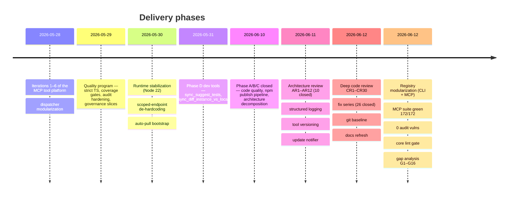
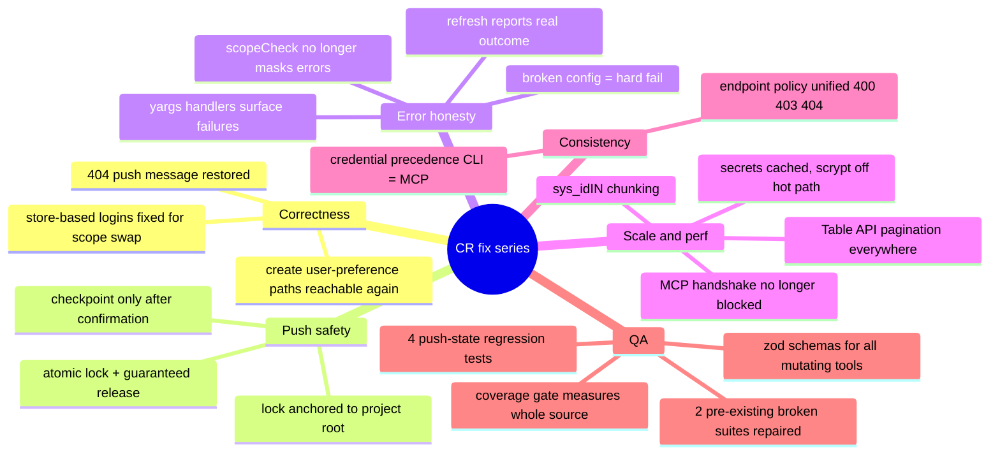

# SyncroNow AI — Product State

> Last updated: 2026-06-21. Companion document: [ARCHITECTURE.md](ARCHITECTURE.md).
> Working journals: `TODO` (open work), `DONE` (completed work, chronological).

## TL;DR

| | |
|---|---|
| Readiness | **~85%** — 8.5/10 toward the 9.5 "real-world ready" target (≈89% of the target); main blocker: D5 distribution |
| CLI | 16 commands (registry-driven, `cliCommands.ts`), end-to-end usable against scoped apps **with or without** the companion scoped app installed |
| MCP server | ~60 tools in 11 registry modules (`toolModules.ts`), governance stack (validation → policy → preflight → audit → metrics) in place |
| Tests | **381 green** — core: 33 suites / 206 tests (jest, incl. dist-binary e2e smoke + AR2 keychain); mcp: 175 tests (node:test vs dist) |
| Coverage | core **70.3%** lines / mcp **82.7%** lines (≈75–77% combined) — see [Metrics snapshot](#metrics-snapshot-2026-06-12) |
| Lint / security | eslint `--max-warnings=0` on core **and** mcp-server; dependency-cruiser module boundaries (G10); `npm audit --omit=dev` = **0 vulnerabilities** |
| Version control | git on `main`; remote `origin` → github.com/IvanBBaev/syncrona (**private**) |
| Biggest gaps | distribution (Homebrew/Windows), live-instance compatibility matrix, DX backlog (DX1–DX24); **owner-gated** publish decisions (IP/provenance, brand, npm scope) |

## Metrics snapshot (2026-06-12)

Measured after the CR fix series, modularization, and best-practice hardening.
Re-measure with `npx jest --coverage` (core) and
`node scripts/check-coverage-gate.js` (mcp-server).

| Package | Lines | Statements | Branches | Functions | Tests | Gate |
|---|---|---|---|---|---|---|
| @syncro-now-ai/core | **70.3%** | 70.6% | 55.8% | 60.7% | 152 (jest, whole src) | ratchet 68/54/58/68 → target 80 (CR26) |
| @syncro-now-ai/mcp-server | **82.7%** | — | 75.0% | 84.9% | 172 (node:test) | 70% lines + 70% branches (G12 ✅) |

Notes:
- `credential-store` and `sn-transport` are covered through their consumers'
  suites; the build plugin packages (babel/webpack/sass/…) have **no tests**
  (tracked via G13).
- Fastest coverage wins: core branch coverage (55.8% — error paths in
  `snClient`/`manifestBuilder`) and first tests for the plugin packages.

## Phase history

| Phase | Scope | Status |
|---|---|---|
| A — Code quality | fallback tests, static imports, wizard UX | ✅ closed (2026-06-10) |
| B — Standalone MVP | `npm i -g` works end-to-end, publish pipeline | ✅ closed (2026-06-10) |
| C — Architecture | decomposition, typed CLI, config reload | ✅ closed (2026-06-10) |
| D — Feature completion | ATF generation, instance diff, logging, **distribution** | 🟡 D1–D4 done; **D5 distribution open** |
| AR — Architecture review 2026-06-11 | 12 findings | 🟡 10 closed; AR1/AR2/AR9/AR11 residuals |
| CR — Deep review 2026-06-12 | 30 findings (senior/architect/QA) | 🟡 26 closed; CR1/CR2/CR22/CR26 residuals |
| Modularization 2026-06-12 | registry-driven CLI commands + MCP tool modules, module contract in ARCHITECTURE §5 | ✅ closed |
| Best-practice hardening 2026-06-12 | 0 audit vulnerabilities, core lint gate, package metadata, CONTRIBUTING.md | ✅ closed |
| G — Triple gap analysis 2026-06-12 | 16 missing-capability findings (OAuth, E2E, CI matrix, release automation…) | 🟡 G2/G5 done; G15/G16 partial (Linux CI job + audit gate); rest open (order in TODO) |
| DX — DX research backlog | 24 usability findings | 🔴 open backlog (5 quick wins identified) |

## What works today

### CLI (`npx syncro-now-ai …`)

| Command | State | Notes |
|---|---|---|
| `init` | ✅ | wizard, or non-interactive all-scope bootstrap when `.env` present |
| `download <scope>` | ✅ | scoped endpoint with full Table-API fallback (paginated, chunked) |
| `refresh` / `dev` | ✅ | manifest sync + watch mode; serialized watcher queue, overlap-guarded interval |
| `push` | ✅ | confirm → atomic collaboration lock → checkpoint/resume → concurrent push; `--diff`, `--dry-run`, `--ci`, `--updateSet`, `--scopeSwap` |
| `build` / `deploy` | ✅ | plugin pipeline (babel/ts/webpack/sass/prettier) → build dir → deploy |
| `docs` | ✅ | per-scope Markdown + mermaid docs generated from the manifest |
| `status` / `doctor` / `plugins` | ✅ | diagnostics, connectivity, plugin-rule report |
| `login` / `logout` / `instances` / `use` | ✅ | global encrypted credential store with active-instance marker |
| `mcp` | ✅ | starts MCP server, auto-configures `.vscode/mcp.json` + secrets file |

Cross-cutting CLI behavior: strict yargs surface (unknown commands fail),
every async handler reports real errors with non-zero exit; update notifier
(1×/day, stderr, opt-out envs); works against instances **without** the
companion scoped app via the Table-API fallback layer.

### MCP server

- ~60 tools across 11 handler groups: session/preflight, workspace commands,
  ServiceNow CRUD, insights, metadata analysis, script analysis,
  health/planning, scope knowledge, relation onboarding, unified workflow,
  developer tools (ATF test suggestion, instance-vs-local diff).
- Governance: zod validation (all mutating tools schema-covered), guardrail
  policy file, preflight enforcement for mutations, dry-run everywhere,
  redacted audit JSONL with rotation + startup integrity quarantine,
  per-tool metrics persisted across restarts, correlation IDs end-to-end,
  structured stderr logging (text/JSON), graceful shutdown with drain,
  optional health HTTP endpoint, tool lifecycle/version metadata with a
  dormant deprecation-warning mechanism.
- Startup: connects stdio first, then auto-pulls scopes in the background.

### Shared foundation

- `@syncro-now-ai/credential-store` — single source of truth for at-rest crypto
  (AES-256-GCM, machine-derived key), async API for the CLI + sync API for
  the MCP server. *Known limitation: key derivation is obfuscation-grade
  until Keychain lands (AR2/D5).*
- `@syncro-now-ai/sn-transport` — shared scoped-prefix, retry-status, and
  endpoint-not-found policies consumed by both HTTP clients.

## 2026-06-12 fix series — what changed (CR1–CR30)

Reliability-focused hardening after a three-perspective review. Full detail in
`DONE`; the headline changes:

## What is NOT done

1. **D5 distribution** — scaffolding shipped in [`packaging/`](../packaging/)
   (Homebrew formula template, Windows `install.ps1`, provenance release
   workflow); activation is **owner-gated** on npm publish (scope ownership +
   2FA) and repo-public. macOS/Windows/libsecret keychain for the at-rest key
   shipped via AR2 (opt-in). Remaining: `homebrew-tap` repo + first publish to
   complete the "brew install syncro-now-ai" definition of done.
2. **Manual/infra residuals** — rotate the old dev-instance password (AR1/CR2);
   verify the `sys.scripts.do` fallback against a live instance (CR22).
3. **Engineering debt accepted knowingly** — mcp tests run against `dist/`
   (AR9, high-risk migration); module-level state pending a context object
   (AR11); coverage ratchet heading to 80 (CR26).
4. **Gap backlog G1–G16** (triple analysis, 2026-06-12 — details and order in
   `TODO`). **Shipped since:** OAuth 2.0 (G1), config schema validation (G2),
   MCP rate limiting (G4), typed CLI args (G5), release automation via Changesets
   (G6), machine-enforced module boundaries (G10), mcp branch coverage (G12), OS
   matrix in CI (G15), security automation (G16). **Remaining:** download
   resume/progress (G3), CLI telemetry (G7), plugin API contract (G8), proxy/TLS
   support (G9), E2E tests against an instance (G11), mutation testing (G13),
   performance baselines (G14).
5. **DX backlog (DX1–DX24)** — onboarding (`check-env`, credential-source
   visibility), help examples, multi-instance guide, plugin-dev docs, error
   taxonomy, progress bars. Quick wins shortlisted in `TODO`.

## Operating constraints

- Node ≥ 22, npm ≥ 10 (enforced via `engines`; CI runs Node 22).
- ServiceNow auth defaults to Basic (user/password); OAuth 2.0 is available
  opt-in on both the CLI and the MCP server (`SN_OAUTH_*`).
- The MCP safety layer is a guardrail, not a sandbox — run it with credentials
  you would trust the calling agent to hold (see mcp README "Safety note").
- Windows support is best-effort (WSL recommended; `differentiatorField`
  naming can produce non-Windows-safe paths — DX11).
