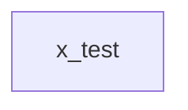

# Scope: x_test

<!-- SYNCRONA:DOCS:START -->
_Generated by syncrona on 2026-06-10T16:34:57.509Z. Content inside this block is regenerated on each sync — add manual notes outside the block._

## Overview

- Scope: `x_test`
- Tables: 0
- Records: 0
- Files: 0

## Architecture

## Tables

_No tables were found for this scope._
<!-- SYNCRONA:DOCS:END -->
